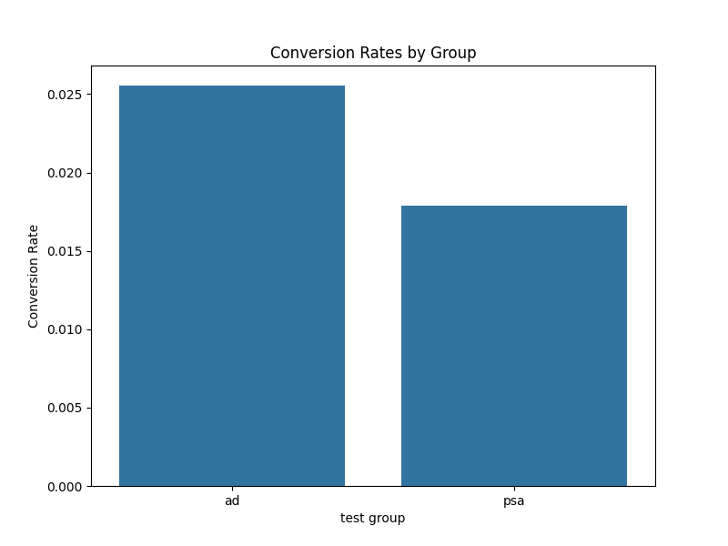
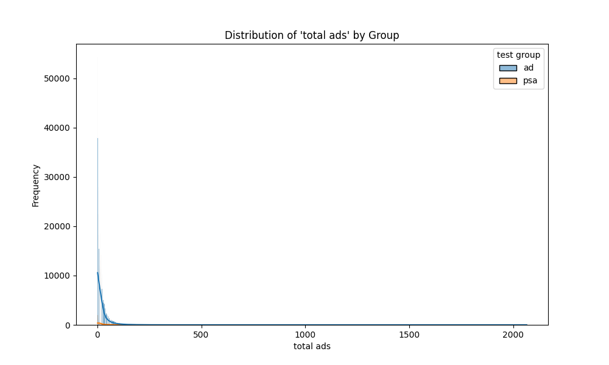
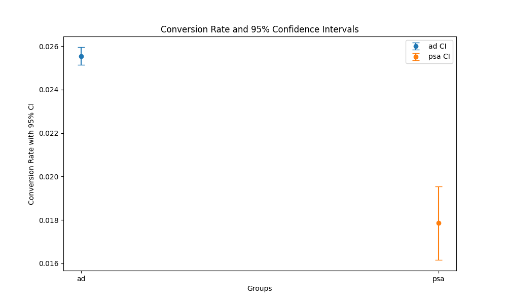

# Marketing A/B Test Analysis

This project analyzes the results of an A/B test conducted by a marketing company to determine the effectiveness of online advertisements compared to a public service announcement (PSA). The analysis focuses on whether the ad campaign was successful and quantifies the impact of the advertisements on customer conversion rates.

## Dataset

The dataset used in this project contains the following features:

- **user id**: Unique identifier for each user.
- **test group**: Indicates if the user was part of the "ad" group (saw the advertisement) or the "psa" group (saw the public service announcement).
- **converted**: A boolean indicating if the user made a purchase (converted) after seeing the content.
- **total ads**: The total number of advertisements seen by the user.
- **most ads day**: The day of the week the user saw the most ads.
- **most ads hour**: The hour of the day the user saw the most ads.

The dataset was sourced from Kaggle: [Marketing A/B testing dataset](https://www.kaggle.com/datasets/faviovaz/marketing-ab-testing).

## Project Structure

your_project/
├── data/
│ └── raw/
│ └── 1/
│ └── marketing_AB.csv
├── src/
│ ├── ab_analyzer.py # Main analysis logic
│ ├── data_loader.py # Class to load the data
│ ├── stats_utils.py # Class for statistical calculations
│ ├── visualization.py # Class for visualizations
│ └── main.py # Script to run the analysis
├── notebooks/ # Optional: for exploratory analysis
│ └── exploratory_analysis.ipynb
├── tests/
│ └── test_ab_analyzer.py
├── requirements.txt
└── README.md

## Analysis

The project is structured around several Python modules:

- **`data_loader.py`**: Loads data and performs basic preprocessing.
- **`stats_utils.py`**: Provides statistical functions for calculations like conversion rates, confidence intervals, and hypothesis testing.
- **`visualization.py`**: Creates data visualizations to support the analysis.
- **`ab_analyzer.py`**: Orchestrates the whole analysis by loading the data, running the statistical calculations, and generating the visualizations.
- **`main.py`**: The main script that executes the analysis.
- **`tests/`**: Contains test files to verify the code.

The key steps of the analysis are:

1.  **Data Loading:** Loading the data from the CSV file.
2.  **Conversion Rate Calculation:** Computing the conversion rate for both the "ad" and "psa" groups.
3.  **Confidence Interval Calculation:** Generating 95% confidence intervals for the conversion rates of both groups.
4.  **Hypothesis Testing:** Performing a two-sample t-test to determine if the difference in conversion rates between the two groups is statistically significant.
5.  **Additional Feature Analysis**: Plotting the distributions of the total ads seen per user in each group.
6.  **Visualization:** Creating visualizations to support our analysis, which include the conversion rates for each group, the confidence intervals, and the distribution of total ads.

## Results

### Statistical Summary

| Metric                    | Ad Group | PSA Group |
| ------------------------- | -------- | --------- |
| Sample Size               | 564,577  | 23,524    |
| Number of Conversions     | 14,423   | 420       |
| Conversion Rate           | 2.55%    | 1.79%     |
| Lower Bound (95% CI)      | 2.51%    | 1.62%     |
| Upper Bound (95% CI)      | 2.60%    | 1.95%     |
| T-statistic               | 8.66     | N/A       |
| P-value                   | 5.11e-18 | N/A       |
| Statistically Significant | True     | N/A       |

### Visualizations

#### Conversion Rates by Group



This bar chart visually represents the difference in conversion rates between the "ad" and "psa" groups. We can see that the "ad" group has a higher conversion rate.

#### Distribution of 'total ads' by Group



This plot shows that people in the 'psa' group see almost no ads, while people in the 'ad' group see more ads, and that the amount of ads they saw seems to follow an exponential pattern.

#### Conversion Rate and 95% Confidence Intervals



This plot shows the conversion rate along with the 95% confidence intervals, and we can clearly see that the confidence intervals of the two groups do not overlap.

### Key Findings

- **Higher Conversion Rate with Ads:** The conversion rate for the "ad" group (2.55%) was significantly higher than the "psa" group (1.79%).
- **Statistical Significance:** The t-test produced a highly significant p-value (5.11e-18), indicating that the difference in conversion rates between the "ad" and "psa" groups is not due to random chance. The calculated t-statistic is 8.66, which is large compared to the critical value of the t-test, and this further confirms that there is a difference between the groups.
- **Non-Overlapping Confidence Intervals**: The 95% confidence intervals for the "ad" and "psa" groups do not overlap, providing further statistical evidence that there is a real difference between the two groups and that the ad performed better.
- **Effect of Ads:** The number of ads that a person saw was greater in the "ad" group, and the distribution of total ads follows an exponential distribution, where most people saw very few ads, and very few people saw a lot of ads.

## Conclusion

The results of this A/B test strongly suggest that the online advertising campaign was effective in driving conversions. The "ad" group had a statistically significant and higher conversion rate than the "psa" group.

**Therefore, the marketing company should continue using the ads as they are outperforming the public service announcements.**

## How to Run the Code

1.  Clone this repository.
2.  Set up your environment:
    ```bash
    python -m venv ab_testing_venv
    source ab_testing_venv/bin/activate # On MacOS/Linux
    # ab_testing_venv\Scripts\activate # On Windows
    pip install -r requirements.txt
    ```
3.  Download the dataset from the provided Kaggle link and place the `marketing_AB.csv` file in the `data/raw/1/` directory.
4.  Run the analysis script:

    ```bash
    python src/main.py
    ```

    The visualizations and a project report will be generated in the `reports/` directory.

## Further Work

- Explore how different days and times of the week influence the conversion rates.
- Investigate if there are any other significant user segments that are particularly influenced by the ads.
- Incorporate a cost/benefit analysis of running the ads.
- Explore the impact of user behavior on conversions and make changes accordingly.
